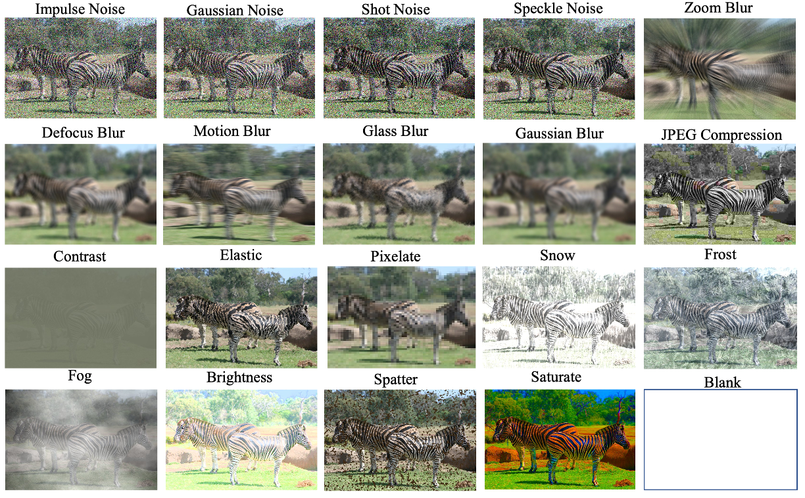
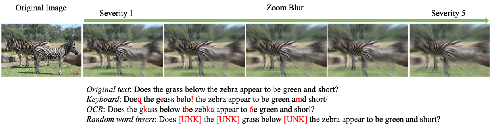
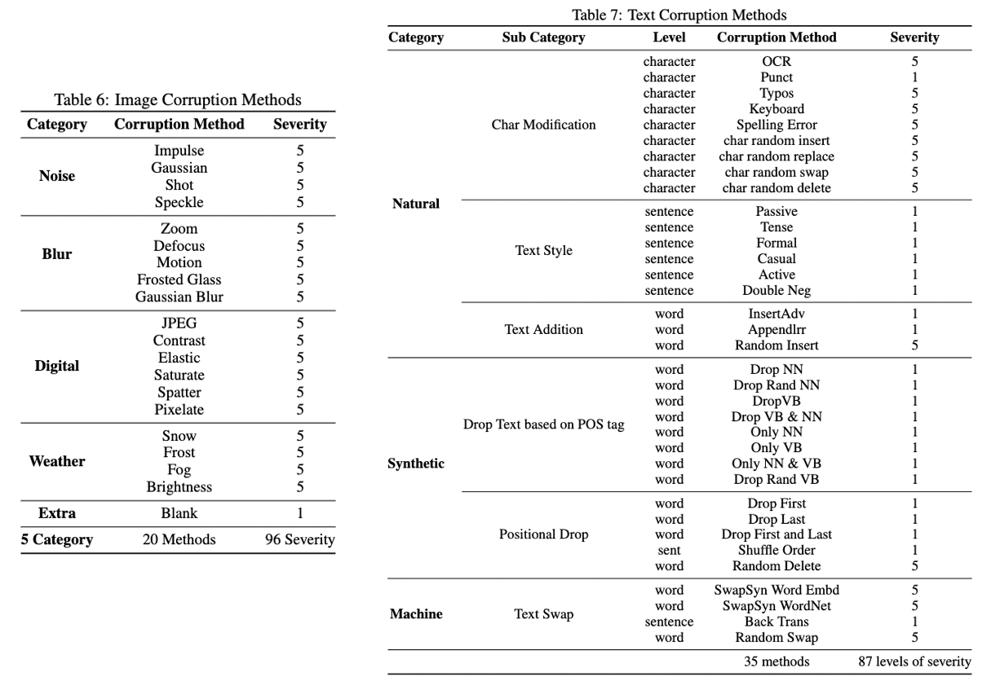

# Image and Text Corruptions
This repo aims to synthesis natural distribution shifts on image and text datasets. 
We provide a set of image and text corruptions that are easy to use and can be applied to any image and text datasets. 
Specifically, this repo is designed for the paper [Benchmarking Robustness of Adaptation Methods on Pre-trained Vision-Language Models
](https://arxiv.org/abs/2306.02080) which introduces 7 benchmark datasets, including 96 visual and 87 textual corruptions.

## Supported Corruptions




## Installation

```bash
git clone 
cd corruption
conda create -n corruption python=3.10.0
conda activate corruption
pip install -r requirements.txt
```

## Usage
### Corrupting Image Datasets
```bash
cd image_corruption
python corruption.py \
  --method METHOD_NAME \
  --image_root_folder FOLDER_PATH_TO_IMAGE_DATA \
  --severity_begin 1 \
  --severity_end 5 \
  --batch_size 100 \
  --num_workers 10
```
### Corrupting Text Datasets
```bash
cd text_corruption
python corruption.py \
  --task TASK_NAME \
  --split SPLIT_NAME \
  --corruption_category CORRUPTION_CATEGORY \
  --corruption_method CORRUPTION_METHOD \
  --severity_begin 1 \
  --severity_end 5 \

```
## Acknowledgement
This repo is built based on the following repos:
- [ImageNet-C](https://github.com/hendrycks/robustness)
- [MM_Robustness](https://github.com/Jason-Qiu/MM_Robustness)
- [VideoLanguageModelRobustness](https://github.com/Maddy12/VideoLanguageModelRobustness)

## Citation
Please cite our paper if you find this repo useful in your research:
```bibtex
@article{chen2023benchmarking,
  title={Benchmarking Robustness of Adaptation Methods on Pre-trained Vision-Language Models},
  author={Chen, Shuo and Gu, Jindong and Han, Zhen and Ma, Yunpu and Torr, Philip and Tresp, Volker},
  journal={arXiv preprint arXiv:2306.02080},
  year={2023}
}
```